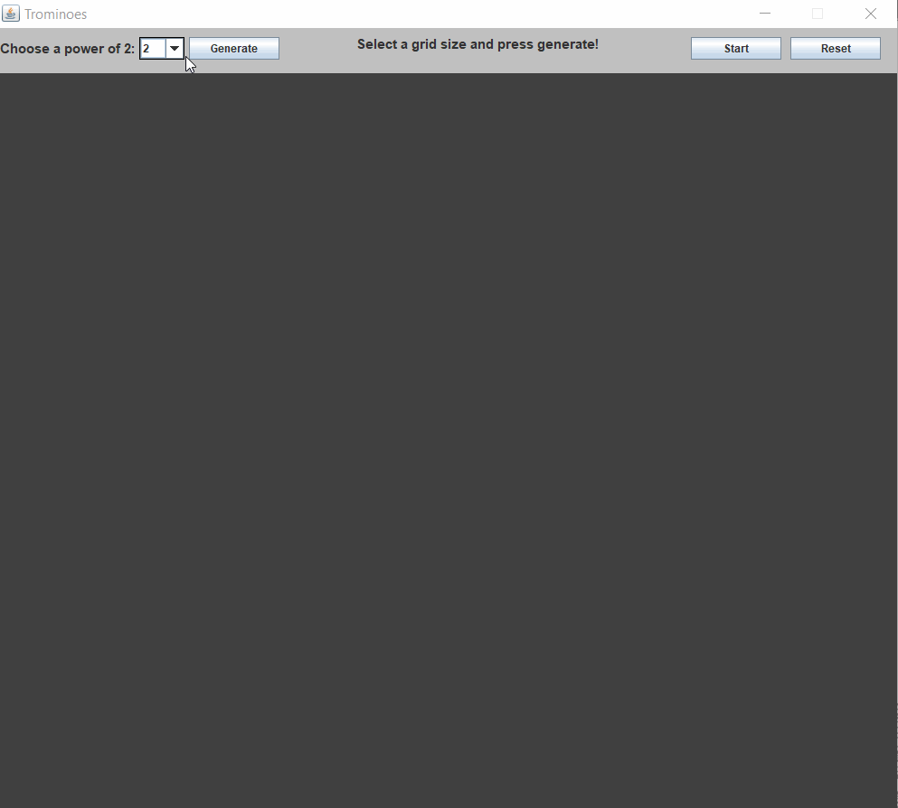
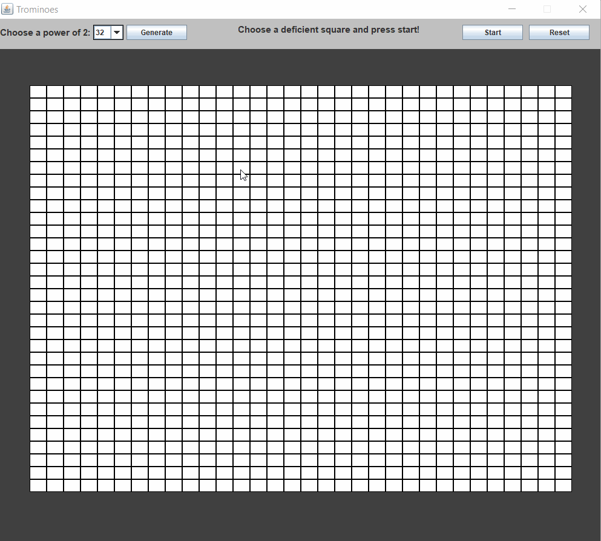

# Tiling with Trominos Project
## csci211-spr19-program-01

## Features

### Create a Grid with Varying Dimensions
A grid of buttons is generated using the user-specified dimensions.

### Tile the Generated Grid Around a Deficient Square With Trominoes
Trominoes of a diverse set of colors are systematically tiled around the deficient square until the grid has been filled.

